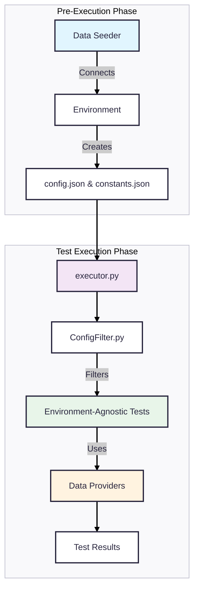
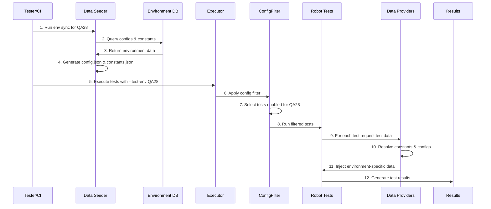
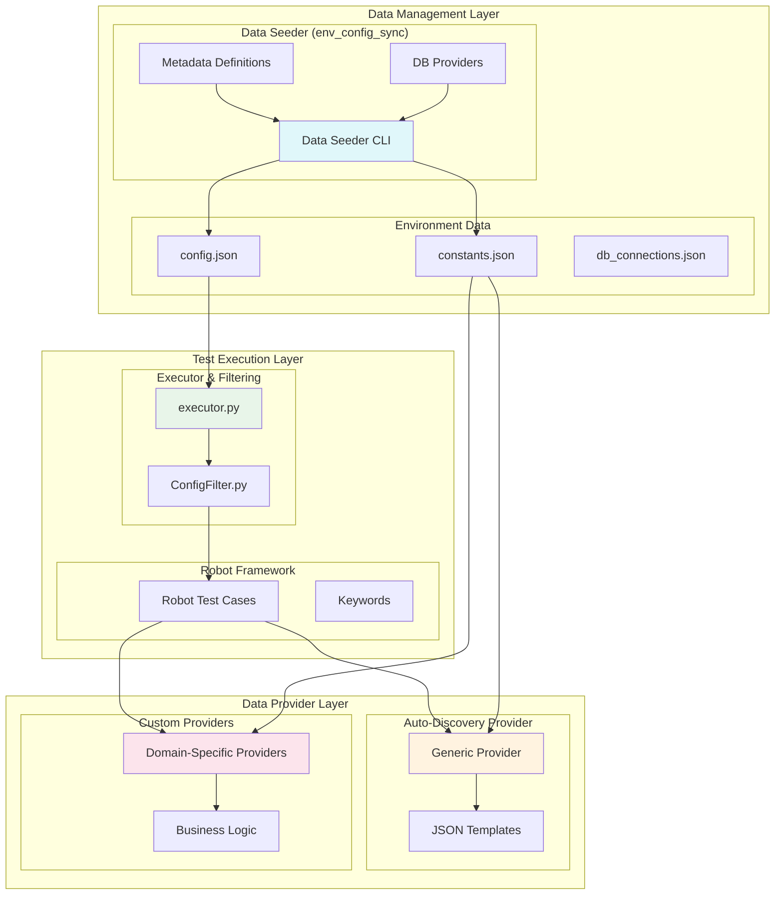
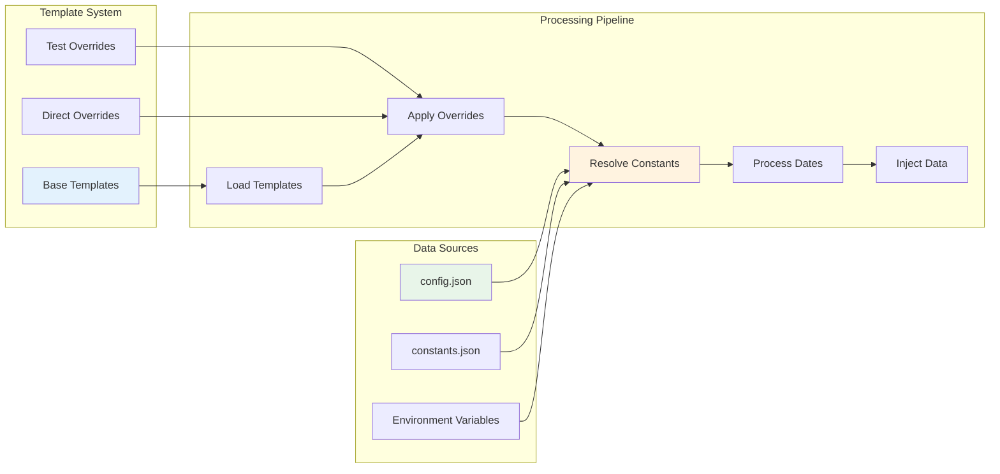
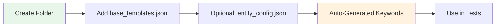
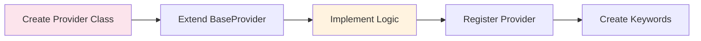
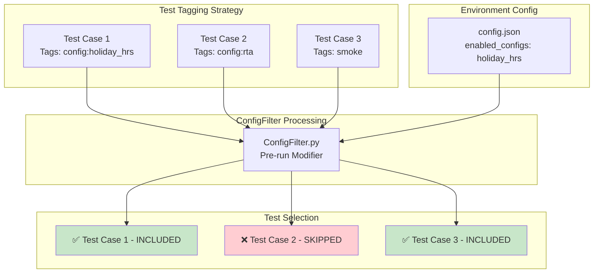

# Environment-Agnostic Test Automation Framework Overview

This document provides a comprehensive overview of our Robot Framework test automation architecture designed for environment-agnostic testing across multiple deployment environments.

## 🎯 Problem Statement

WFM has a complex configurations across environments (Customers, QA boxes). Traditional testing approaches require:
- Hard-coded environment values in tests
- Separate test data files per environment  
- Manual updates when configurations change
- Test metadata to know which test executes on what environment
- Test maintenance overhead

## 🚀 Our Solution

We've built an environment-agnostic framework that separates test logic from environment data using:
1. **Data Seeder Strategy** - Automatically fetches environment configs from DB
2. **Data Provider Strategy** - Injects environment-specific data into tests at runtime
3. **Config-Aware Execution** - Runs only tests applicable to current environment

---

## High-Level Architecture Overview



**Key Benefits:**
- ✅ Write tests once, run anywhere
- ✅ Zero environment-specific code in tests
- ✅ Automatic config synchronization
- ✅ Selective test execution based on environment capabilities

---

## Detailed Execution Process Flow



---

## Component Architecture



---

## 📋 Data Provider Strategy Details



### Two Provider Approaches:

#### 1. Auto-Discovery Provider (Recommended for New Entities)


**Example:**
```
test_data/entities/schedule/
├── base_templates.json     # Required
├── entity_config.json      # Optional
└── overrides/              # Optional
```

#### 2. Domain-Specific Providers (For Complex Logic)


---

## 🔧 Configuration-Aware Test Execution



---

## 🛠️ Quick Start Guide

### For New Testers
We recommend going through details & [contribution](CONTRIBUTING.md)

#### 1. Get Environment Specific Data
```bash
# Add DB connection details
# Edit: test_data/environments/db_connections.json

# Run data seeder
python -m dev_utils.env_config_sync.cli --env NEW_ENV
```

#### 2. Add New Test Data Entity (Zero Code!)
```bash
# Create folder structure
mkdir test_data/entities/my_entity

# Add templates [Just a sample]
echo '{"default": {"field1": "value1"}}' > base_templates.json
```

#### 3. Use in Robot Tests
```robotframework
*** Test Cases ***
My Test
    ${data}=    Get My Entity Data    field1=custom_value
    # Use ${data} in your test
```

#### 4. Run Tests
```bash
python executor.py tests/web/ --test-env QA28
```

### For Complex Scenarios

#### Create Custom Provider
```python
class MyProvider(BaseDataProvider):
    def get_my_data(self, **overrides):
        # Custom business logic
        return processed_data
```

---


## 🔍 Troubleshooting

### Common Issues and Solutions

| Issue | Solution |
|-------|----------|
| Environment not found | Check `test_data/environments/{ENV_NAME}/` exists |
| Config not resolved | Run data seeder: `python -m dev_utils.env_config_sync.cli --env {ENV}` |
| Test skipped unexpectedly | Check `config.json` has required config in `enabled_configs` |
| Data provider not found | Verify template folder exists with `base_templates.json` |

### Debug Commands
```bash
# Check environment data
cat test_data/environments/QA28/config.json

# Dry run tests
python executor.py tests/web/ --test-env QA28 --dry-run

# Verbose data seeder
python -m dev_utils.env_config_sync.cli --env QA28 --verbose
```

---

## 🎯 Best Practices

1. **Environment Setup**
   - Always run data seeder before test execution
   - Keep DB credentials secure and use environment variables
   - Use meaningful environment names

2. **Test Data Management**
   - Prefer auto-discovery provider for simple entities
   - Use custom providers only for complex business logic
   - Keep templates simple and reusable
   - Use logical constants instead of hard-coded values

3. **Test Design**
   - Tag tests with required configurations
   - Write environment-agnostic test logic
   - Use descriptive template names
   - Document complex data transformations

4. **Maintenance**
   - Regularly sync environment configurations
   - Review and update templates as business logic changes
   - Monitor test execution logs for data-related issues

---
## Limitations

- Environment sync util only supports DB for now. API based support can be added but enabling API access of environments will require additional security measures & setup steps (enable authtoken)
- Environment specific locator is not supported. Engineering should be fixing these.
- No support for globalization keys sync. A test strategy for handling localization and internationalization is needed.

---

## Related Documentation

- [Data Provider Strategy](TEST_DATA_PROVIDER_STRATEGY.md)  
- [Simplified Provider Guide](SIMPLIFIED_DATA_PROVIDER_GUIDE.md)
- [Data Seeder Utility](TEST_DATA_SEEDER_UTILITY.md)
- [Config-Aware Execution](CONFIG_AWARE_TEST_EXECUTION.md)

---

*This framework enables true environment-agnostic testing by separating test logic from environment data, making it easy to scale across multiple environments while maintaining test consistency and reliability.*
