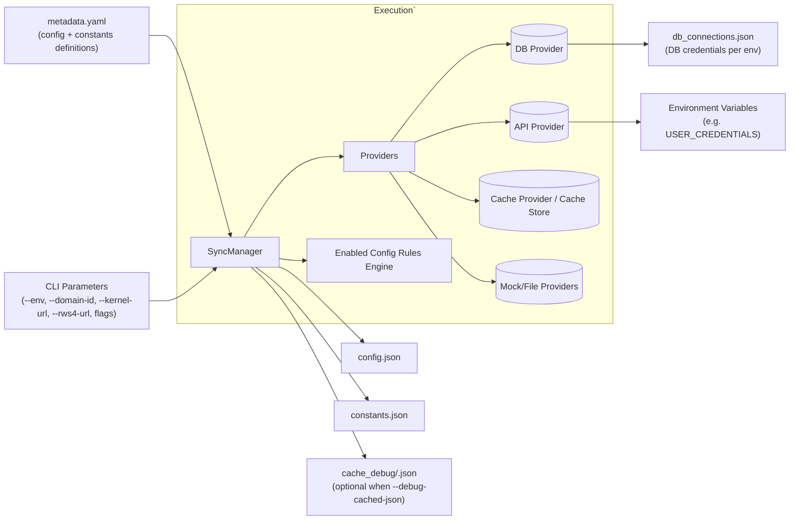

# Environment Configuration Synchronization

This utility fetches environment-specific configuration and constants from various data sources and writes them to JSON files (config.json, constants.json) for use in testing and automation. Different environments (e.g., QA28_B0, BMR_SB) have unique configurations stored in databases or accessible via APIs. This tool centralizes the retrieval and storage of these configurations provided we know what to fetch and how to transform it.


## Features

- Metadata-driven approach: define configuration items and their data sources in a yaml file (metadata.yaml)
- Support for fetching configurations from multiple data sources :
    - DB2 database
    - Authenticated HTTP APIs (headless browser login via Playwright)
    - Mock data (for testing)
    - Extensible to add file or additional provider types for future needs like File etc.
- Optimized synchronization:
  - Batch queries to reduce database round-trips
  - Group related items by source group
  - Cache snapshots to reuse large table datasets across multiple metadata items
- Flexible transformation of data - boolean, integer, float, string, JSON parsing
- Enabled config rules to derive feature toggles based on synced values
- Command-line interface for easy integration with automation workflows

## Architecture Overview



**How to read the diagram**
- metadata.yaml, db_connections.json, environment variables, and CLI parameters feed into the execution pipeline.
- `SyncManager` batches metadata items by provider, updates caches, and evaluates enabled-config rules before writing JSON outputs.
- Optional cache debug files illustrate the structure of cached datasets when troubleshooting metadata changes.

## Environment & Configuration Prerequisites

- **Credential bootstrap**: Populate the `USER_CREDENTIALS` environment variable before running the utility. Each entry should expose the `user_key` your metadata references (for example `ESS2_STORE1`, though any key can be supplied via YAML). The API provider logs into the UI first, captures the auth token, and reuses it for every HTTP request.
- **Database connections**: Ensure `dev_utils\env_config_sync\db_connections.json` contains a record for your `--env` value. The DB2 provider reads credentials, host, and schema details from this file at runtime. Refer to the sample format in the "Database Connection Configuration" section below.
- **Dry-run behavior**: Supplying `--dry-run` still executes every provider batch (DB/API/file/mock/cache) and populates the cache store, but `_save_json_file` short-circuits so nothing touches `config.json`/`constants.json`.
- **Metadata.yaml**: Provide a metadata.yaml file. The utility by default looks for metadata.yaml in env_config_sync directory. Customize or extend the default metadata by supplying `--metadata <PATH>` to point at an alternate YAML file. This is useful for experiments or temporary overrides without modifying the canonical `metadata.yaml`. Check the "Metadata YAML Reference" section below for schema details.
- **Environment data sync**: Run `python -m dev_utils.env_config_sync.cli --env <NAME> --config-only` (or `sync_all`) before invoking keywords that rely on API payloads. This guarantees that derived keys such as `kernel_url`, `login_url`, or domain identifiers are refreshed before downstream API metadata executes.
These prerequisites are the minimum required for a new teammate to fetch config/constant files successfully.

## Metadata YAML Reference

The metadata YAML file is the contract between SyncManager and each data source. It describes **what** needs to be fetched (config vs. constants), **where** it should be written in the resulting JSON files, and **how** the data should be retrieved or transformed. Every entry lives under the top-level `config_items` list, and the loader validates the entire document against a JSON Schema before any queries are executed—syntax errors are surfaced with line numbers instead of failing mid-sync.

Think of each item as: "Take data from a provider (`data_source`), run the specified query block, optionally transform it, then upsert it at `path` inside `config.json` or `constants.json`." The fields below control that flow.

Each config item contains the following fields:
| Property | Type | Required | Notes |
| --- | --- | --- | --- |
| `target` | `config \| constants` | Yes | Determines whether the result writes to `config.json` or `constants.json`. |
| `path` | List[str] | Yes (defaults to `[]`) | Nested path to update. Use an empty list to merge key/value pairs into the root. |
| `data_source` | `db \| api \| file \| mock \| cache` | Yes | Chooses which provider executes the query block. |
| `source_group` | str | Optional | Automatically defaults to `target`. Only add it when you need to batch multiple items together beyond the `config/constants` split. |
| `description` | str | Yes | Human readable purpose (used heavily during reviews). |
| `cache_key` | str | Optional | When set, the raw query result is cached under this key so downstream cache-driven items can reuse it. (`payload_namespace` remains a backward-compatible alias.) |
| `cached_only` | bool | Optional | Keep the cached result but but dont write to {target}.json file. (`skip_write` is still accepted as an alias.) |
| `query` | dict | Yes | Provider-specific block described below. Aliases like `statement`, `db_query`, or `api_query` map back to `query` automatically. |

### `data_source` options

| Value | Provider | Typical use |
| --- | --- | --- |
| `db` | DB2 provider | Issue SQL queries against environment databases. Requires `params` such as `owner_id`. |
| `api` | Playwright-authenticated HTTP client | Call kernel/Reflexis endpoints that require a logged-in session. Supports JSON and CSV responses. |
| `file` | Local file reader | Pull static JSON/CSV snippets already checked into the repo. Useful for seed data. |
| `mock` | Deterministic data provider | Return literal values for testing or to stub future queries. |
| `cache` | Cached data hydrator | Reuse data produced by earlier items (`cache_key`) without hitting the source again. |

### `result_type` choices

| Value | Description | Example use |
| --- | --- | --- |
| `single_value` | Take the first column of the first row | Flags such as `FISCAL_WEEK_START_DAY`. |
| `multiple_values` | Return a flat list of the first column | Feature toggles where only IDs matter. |
| `key_value_map` | Produce a `{key: value}` dictionary using `key_column` / `value_column` | `APPNAME` / `APPURL` pairs, constants tables, etc. |
| `json_object_map` | Map a chosen column to the **entire** row (converted to JSON) | Storing store/location metadata keyed by `STORE_ID`. |

If omitted, `result_type` defaults to `single_value`.

### `transform` helpers

Transforms run after data retrieval and before writing to disk. Common options:

| Value | Effect |
| --- | --- |
| `boolean` | Coerce truthy / falsy values into strict booleans. |
| `integer` / `float` | Convert numeric strings into the requested type. |
| `string` | Force a value to a string (handy for JSON serialization). |
| `json` | Parse a JSON string column into a native structure. |
| `uppercase_key` | Uppercase dictionary keys (used for constants). |
| `none` (default) | Leave the data untouched. |

Custom transforms may be registered via `TransformRegistry` when specialized logic is required.

When a query returns a dictionary (for example `result_type: key_value_map`), you can optionally specify `value_transform` / `value_transform_function` to coerce **each entry's value** before any map-wide transform runs. This is ideal for columns that store JSON blobs as text because it preserves the original keys while parsing their payloads.

### Database query block

| Field | Type | Required | Notes |
| --- | --- | --- | --- |
| `query` / `statement` | str | Yes | SQL text; aliases (`statement`, `db_query`, `sql`) are accepted for readability. |
| `params` | List[str] | Optional | Ordered placeholders substituted via provider (e.g., `owner_id`). |
| `key_column` / `value_column` | str | Required for `key_value_map` | Maps result rows into dictionaries. |
| `result_type` | Enum | Optional | Defaults to `single_value`; other options: `multiple_values`, `key_value_map`, `json_object_map`. |
| `transform` | Enum | Optional | `none`, `boolean`, `integer`, `float`, `string`, `json`, `uppercase_key`. |
| `value_transform` | Enum | Optional | Same values as `transform`, but applied to each dictionary entry (useful for JSON string columns). |
| `value_transform_function` | str | Optional | Name of a custom transform used for per-entry conversions. |
| `fallback_value` | Any | Optional | Used when the query returns no rows. |

### API query block

| Field | Type | Required | Notes |
| --- | --- | --- | --- |
| `url` | str | Yes | Relative endpoint (e.g., `/auth/exports/...`). |
| `method` | str | Optional | Defaults to `GET`; `POST` for CSV export sample. |
| `path_params` | List[str] | Optional | Injected into `url` in order; supports `$config.<path>` lookups so DB harvested values are available before API batches.
| `auth_user_key` | str | Optional | Name inside `USER_CREDENTIALS`; can be any key, not just `ESS2_STORE1`.
| `base_url_key` | str | Optional | Config key for the API host (`kernel_url` by default, `rws4_url` for alternate hosts).
| `response_type` | `json \| csv` | Optional | CSV payloads are normalized to JSON rows automatically.
| `response_path` | str | Optional | Dot path to slice JSON responses.
| `value_transform` | Enum | Optional | Per-entry transform for dictionary payloads (see above).
| `value_transform_function` | str | Optional | Custom function applied per dictionary entry.
| `request_timeout`, `headers`, `params`, `data` | usual HTTP semantics. |

All API calls still rely on the shared Playwright-authenticated session, so new endpoints only need metadata changes as long as they accept token-based auth.

### Cache query block

Cache items point at cached datasets (usually produced by DB/API items with `cache_key`). Use `path` to traverse nested JSON, `value_transform` to coerce dictionary entries, and `transform` to shape the final object before writing.

Sample yaml for producing a cached dataset:

```yaml
  - target: config
    data_source: db
    source_group: core_config
    description: Product feature driven configs as key value map
    cache_key: product_features
    cached_only: true
    query:
      query: |
        SELECT FEATURE_ID,FEATURE_VALUE 
                FROM PRODUCT_FEATURE 
                WHERE OWNER_ID = ?
      params: [owner_id]
      result_type: key_value_map
      key_column: FEATURE_ID
      value_column: FEATURE_VALUE
      fallback_value: null  
```
Here we are caching a key-value map of product features for reuse by downstream items without writing to `config.json`.
if the cached_only is set to false this data will also be written to config.json
### Ordering guarantees

Within each `source_group`, providers run in the following order: DB, API, FILE, MOCK, CACHE. This ensures that cache metadata executes only after the DB/API batches have populated caches or config keys needed downstream, satisfying the batch optimization requirement.

For maintainability, the loader also sorts `config_items` by `source_group`, `target`, and `path` so git diffs stay tidy regardless of the order in the YAML file.

### Enabled Config Rules

The `enabled_config_rules` section translates synced configuration values into the `enabled_configs` array that powers the Robot Framework `ConfigFilter`. Rules read from the in-memory config snapshot (which evaluates values before they are written) and, when requested, from cache snapshots. Missing data never fails the run; the manager logs a warning and skips the rule.

Each rule supports the fields below:

| Field | Type | Required | Description |
| --- | --- | --- | --- |
| `key` | `str` | Yes | Enabled config name to append when the rule evaluates to true. |
| `description` | `str` | No | Reviewer-friendly note explaining the intent. |
| `source` | `config \| cache` | No (default `config`) | Which context to read (`config` uses the aggregated snapshot, `cache` looks up `cache_key`). |
| `path` | `List[str] \| dot.string` | No | Path segments that resolve to the value being tested. Empty path evaluates against the root of the chosen source. |
| `cache_key` | `str` | Conditionally | Required when `source` is `cache`. Identifies the cached dataset to inspect. (`payload_namespace` still works for legacy metadata.) |
| `condition.type` | `equals \| truthy \| contains \| list_match \| all \| any` | Yes | Determines how the resolved value is evaluated. Use `all`/`any` to compose multiple checks. |
| `condition.value` | `Any` | When needed | Expected value for `equals` / `contains`. |
| `condition.match` | `dict \| list[dict]` | When needed | Key/value pairs that must exist within at least one element for `list_match`. Supply a list to express "match any" semantics. |
| `condition.conditions` | `list` | When type is `all`/`any` | Array of nested condition clauses. Each clause provides a `path`, optional `transform`, and an embedded `condition` block evaluated against that path. |
| `condition.case_insensitive` | `bool` | No | Applies to `list_match` string comparisons. |
| `requires` | `List[path]` | No | Additional paths that must exist; missing data triggers a warning and skips the rule. |
| `transform` | `none \| boolean \| integer \| float \| string \| json` | No | Optional coercion applied before evaluating the condition. Use `json` when metadata stores JSON payloads as strings. (`coerce` remains an alias.) |
| `warn_on_missing` | `bool` | No (default `true`) | Disable to suppress warnings for optional signals. |

Please refer [enabled config rules examples](README_ENABLED_CONFIG_RULES.md) for more detail scenarios.

**Some Examples**

```yaml
enabled_config_rules:
  - key: RTA_ENABLED
    description: Enables RTA tests when DB flag returns Y
    path: [RTA]
    condition:
      type: equals
      value: "Y"

  - key: MYWORK_ENABLED
    description: Toggle based on boolean-like string
    path: [MYWORK_ENABLED]
    transform: boolean
    condition:
      type: truthy

  - key: SYSADMIN_READ_PAYROLL
    description: Grants permission only when SYSADMIN has READ^PAYROLL
    path: [SYSADMIN_PERMISSIONS]
    condition:
      type: list_match
      match:
        permission_id: "READ^PAYROLL"
        access_type: enable

  - key: EMP_AVAILABILITY_ROTATION
    description: Requires a pair of scalar flags to be in the expected state
    condition:
      type: all
      conditions:
        - path: [EMP_AVL_ROTATION]
          condition:
            type: equals
            value: "Y"
        - path: [STAFF_ROTATION]
          condition:
            type: equals
            value: WEEKLY

  - key: UIC_SHOWSECONDARYTASK
    description: Reads parsed JSON stored under entity_5
    path: [uic_configs, entity_5, ENTITY_VALUE, SHOWSECONDARYTASK]
    condition:
      type: truthy

  - key: CACHE_READY
    description: Example cache rule using previously cached dataset
    source: cache
    cache_key: kernel_payloads
    path: [bulk_config, status]
    condition:
      type: equals
      value: ready
```

The sync manager merges rule-derived keys with any pre-existing `enabled_configs`, converts dictionaries to arrays, and writes the sorted list back to `config.json`.


## Setup

- Refer the `docs/CONTRIBUTING.md` for setting up the repository and installing dependencies.
- Run the commands based on your requirements from root of the repository. - Check `Command-line Interface` section under `Usage` for details.

### Troubleshooting Dependency Issues
- If you are on Windows and getting errorts related to DB2 driver / connection while executing the utility - with message like "The ibm_db and ibm_db_dbi modules are required for the DB2Provider. 
  "Please install them using: pip install ibm_db ibm_db_dbi" Its a known issue about how  Windows cannot find the IBM DB2 client libraries (DLLs).
  - To resolve try adding os.add_dll_directory('C:\Users\KG9078\AppData\Local\Programs\Python\Python313\Lib\site-packages\clidriver\bin') in db2.py import section after import Path. Update the path as per your python installation path.


## Usage

### Command-line Interface

```Parameters
usage: cli.py [-h] --env ENVIRONMENT [--owner OWNER_ID] [--config-only] [--constants-only] [--base-path BASE_PATH] [--domain-id DOMAIN_ID] [--kernel-url KERNEL_URL]
              [--rws4-url RWS4_URL] [--login-url LOGIN_URL] [--verbose] [--metadata METADATA_PATH] [--dry-run]

Synchronize environment configuration and constants with data sources.

options:
  -h, --help            show this help message and exit
  --env ENVIRONMENT     The name of the environment to synchronize (e.g., QA28_B0, DEMO05)
  --owner, -o OWNER_ID  Owner ID to use in database queries (default: 111110099)
  --config-only         Synchronize only the configuration (not constants)
  --constants-only      Synchronize only the constants (not configuration)
  --base-path BASE_PATH
                        The base path for the environment files
  --domain-id DOMAIN_ID
                        Kernel Domain id used by downstream API metadata e.g ., TESTING1, BMR etc. Required if api data source is used.
  --kernel-url KERNEL_URL
                        kernel url for the environment. e.g. https://wfmproductqa28.reflexisinc.com/kernel, Required if api data source is used
  --rws4-url RWS4_URL   RWS4 base URL for API calls. e.g. https://wfmproductqa28.reflexisinc.com/RWS4. Required if api data source is used
  --login-url LOGIN_URL
                        Login URL used to bootstrap auth tokens. e.g. https://wfmproductqa28.reflexisinc.com/kernel/views/authenticate/W/TESTING1.view Required if api
                        data source is used.
  --verbose             Enable verbose output
  --metadata METADATA_PATH
                        Path to an alternate metadata YAML file
  --dry-run             Execute all queries but skip writing config/constants files
  --debug-cached-json   Write cached-only datasets to cache_debug/<cache_key>.json for inspection
```

```bash
# Synchronize all configuration and constants for an environment
uv run python -m dev_utils.env_config_sync.cli --env QA28_B0

# Synchronize only configuration
uv run python -m dev_utils.env_config_sync.cli --env QA28_B0 --config-only

# Synchronize only constants
uv run python -m dev_utils.env_config_sync.cli --env QA28_B0 --constants-only

# Specify a custom base path for environment files
uv run python -m dev_utils.env_config_sync.cli --env QA28_B0 --base-path /path/to/environments

# Point at an alternate metadata YAML (useful for experiments or overrides)
uv run python -m dev_utils.env_config_sync.cli --env QA28_B0 --metadata dev_utils/env_config_sync/no-api-metadata.yaml

# Specify a custom owner ID for database queries
uv run python -m dev_utils.env_config_sync.cli --env QA28_B0 --owner 111110099

# Provide bootstrap values when config.json is empty
uv run python -m dev_utils.env_config_sync.cli --env QA29_B0 --domain-id TESTING1 --login-url https://wfmproductqa29.reflexisinc.com/kernel/views/authenticate/W/TESTING1.view --kernel-url https://wfmproductqa29.reflexisinc.com/kernel --rws4-url https://wfmproductqa29.reflexisinc.com/RWS4  --owner 111110051

# Enable verbose output
uv run python -m dev_utils.env_config_sync.cli --env QA28_B0 --verbose

# Execute a dry run (queries + logging only, no file writes)
uv run python -m dev_utils.env_config_sync.cli --env QA28_B0 --dry-run --verbose

# Capture cached-only datasets for troubleshooting
uv run python -m dev_utils.env_config_sync.cli --env QA28_B0 --debug-cached-json --config-only
```

> For metadata with datasource as api `--domain-id` , `--login-url`, `--kernel-url`, `--rws4-url` are mandatory when `config.json` is not yet populated.

#### Alternate metadata files

Use the `--metadata` flag when you want to test a sandbox YAML without touching the canonical `metadata.yaml`. For programmatic scenarios, call `configure_metadata_source("/absolute/path/to/custom.yaml")` before instantiating `SyncManager`.

### Programmatic Usage

```python
from dev_utils.env_config_sync import SyncManager

# Create a synchronization manager for an environment
manager = SyncManager("QA28_B0")

# Create a synchronization manager with a custom owner ID
manager = SyncManager("QA28_B0", owner_id="123456789")

# Synchronize all configuration and constants
manager.sync_all()

# Or synchronize only configuration
manager.sync_config()

# Or synchronize only constants
manager.sync_constants()

# Clean up
manager.close()
```
## Configuration

### Database Connection Configuration

The DB2 provider reads connection details from a JSON file located at:
`dev_utils\env_config_sync\db_connections.json`

Example format:
```json
{
  "QA28_B0": {
    "database": "WFMDB",
    "hostname": "db2hostname.example.com",
    "port": 50000,
    "username": "db2user",
    "password": "password",
    "schema": "WFMSCHEMA"
  },
  "DEMO05": {
    "database": "WFMDB",
    "hostname": "db2hostname-demo.example.com",
    "port": 50000,
    "username": "db2user",
    "password": "password",
    "schema": "WFMSCHEMA"
  }
}
```
Ensure schema names and credentials are accurate for each environment you intend to sync.

If this file doesn't exist, a template will be created automatically.

### Using Empty Path for Direct Key-Value Mapping

When using `result_type: key_value_map`, you can specify an empty path to directly add the key-value pairs to the root of the target file (config.json or constants.json). In the YAML metadata, that looks like:

```yaml
- target: config
    path: []              # Empty path merges keys into config root
    data_source: db
    source_group: core_config
    description: Application settings
    query:
        query: >-
            SELECT PARAM_NAME, PARAM_VALUE
            FROM rfx_config
            WHERE PARAM_NAME IN ('APPNAME', 'APPURL')
        result_type: key_value_map
        key_column: PARAM_NAME
        value_column: PARAM_VALUE
        fallback_value: {}
```

With this configuration, if the query returns:
```
PARAM_NAME | PARAM_VALUE
-----------------------
APPNAME    | MyApp
APPURL     | https://example.com
```

The resulting config.json will have these keys added directly to the root:
```json
{
    "APPNAME": "MyApp",
    "APPURL": "https://example.com",
    "other_existing_key": "other_value"
}
```

This feature is useful when database column names directly map to configuration keys without requiring nesting.

### Using JSON Object Maps

The new `result_type: json_object_map` allows you to convert SQL query results into JSON objects mapped by a specified key column. A YAML entry would look like:

```yaml
- target: config
  path: [stores]
  data_source: db
  source_group: store_config
  description: Store information as JSON objects mapped by store ID
  query:
    statement: >-
      SELECT 
          STORE_ID as id,
          STORE_NAME as name,
          STORE_LOCATION as location,
          STORE_MANAGER as manager,
          STORE_PHONE as phone
      FROM STORES 
      WHERE ACTIVE = 'Y'
    result_type: json_object_map
    key_column: id        # Use the 'id' column as the map key
    fallback_value: {}
```

With this configuration, if the query returns:
```
id     | name        | location   | manager    | phone
-------|-------------|------------|------------|-------------
STORE1 | D1Store 1   | Location1  | John Doe   | 555-0001
STORE2 | D2Store 2   | Location2  | Jane Smith | 555-0002
```

The resulting config.json will have:
```json
{
    "stores": {
        "STORE1": {
            "id": "STORE1",
            "name": "D1Store 1", 
            "location": "Location1",
            "manager": "John Doe",
            "phone": "555-0001"
        },
        "STORE2": {
            "id": "STORE2",
            "name": "D2Store 2",
            "location": "Location2", 
            "manager": "Jane Smith",
            "phone": "555-0002"
        }
    }
}
```

Key features of result_type: json_object_map:
- Each database row becomes a complete JSON object with all columns as attributes
- The `key_column` parameter specifies which column value to use as the map key
- All column names and values are preserved in the resulting JSON objects
- This allows for rich, structured data storage in your configuration files

### Parsing JSON string columns in key/value tables

Many WFM tables store JSON payloads as quoted strings. Combine `result_type: key_value_map` with `value_transform: json` to deserialize each entry before it is merged into `config.json`:

```yaml
- target: config
  path: [ml_configs]
  data_source: db
  source_group: ml_ui
  description: Machine learning UI payloads stored as VARCHAR
  query:
    statement: >-
      SELECT PARAM_NAME, PARAM_VALUE
      FROM ML_UI_CONFIG
      WHERE PARAM_NAME IN (
        'BUILD_MACHINE_LEARNING_MODEL_D_Enable_include_marker',
        'BUILD_MACHINE_LEARNING_MODEL_D_SHOW_TRAINING_GRAPH'
      )
    result_type: key_value_map
    key_column: PARAM_NAME
    value_column: PARAM_VALUE
    value_transform: json
```

The resulting JSON looks like:

```json
"ml_configs": {
  "BUILD_MACHINE_LEARNING_MODEL_D_Enable_include_marker": {"includeMarkers": false},
  "BUILD_MACHINE_LEARNING_MODEL_D_SHOW_TRAINING_GRAPH": {"showTrainingGraph": false, "hideessschbreak": false}
}
```

Because the transform runs before the dictionary is merged, keys remain untouched while each value is converted into a native structure.

### Using Authenticated API Metadata

API metadata entries can now log into the WFM UI via Playwright, reuse the generated auth token, and call kernel endpoints. The query block accepts:

- `url` / `method`: Relative endpoint and HTTP verb.
- `path_params`: Values injected into the URL template. Use `$config.<key>` to pull from `config.json`.
- `auth_user_key`: Credential identifier from `USER_CREDENTIALS`.
- `base_url_key`: Config key for the API host; omit to use `kernel_url`, or set to `rws4_url` for legacy Kernel 4 endpoints.
- `login_url`: Stored globally in `config.json` (bootstrap with `--login-url`). The provider uses it automatically when exchanging credentials for auth tokens.
- `response_type`: `json` (default) or `csv`. CSV responses automatically pass through the existing `convert_csv_to_json` helper.
- `response_path`: Optional dot notation to slice JSON payloads.

Every API call inherits the same header map as `api_executor.resource`, so future endpoints that rely on token-based auth only need metadata changes—no new Robot keywords.

### Cache Snapshots

Metadata items can attach a `cache_key` to capture large datasets (for example, a full table snapshot) and optionally set `cached_only: true` when the data is only meant for downstream consumers. Later items can point to the cached data by using `DataSourceType.CACHE` and referencing the key plus an optional `path` array. This avoids expensive duplicate queries while keeping the metadata shape identical for DB, API, and cache-driven entries.

## Extending

### Adding a New Data Source Provider

1. Create a new provider class that inherits from `DataSourceProvider`
2. Implement the required methods: `connect`, `disconnect`, and `execute_query`
3. Optionally override `execute_batch_query` for optimized batch operations
4. Register the provider with the provider registry:

```python
from dev_utils.env_config_sync.providers.base import (
    DataSourceProvider,
    ProviderRegistry,
)
from dev_utils.env_config_sync.schema import DataSourceType

class MyProvider(DataSourceProvider):
    # Implementation...

# Register the provider
ProviderRegistry.register(DataSourceType.MY_TYPE, MyProvider)
```

### Adding Custom Transformations

1. Define a transformation function
2. Register the function with the transform registry:

```python
from dev_utils.env_config_sync.providers.base import TransformRegistry

def my_transform(value):
    # Transform the value
    return transformed_value

# Register the transformation
TransformRegistry.register("my_transform", my_transform)
```

## Dependencies

- `ibm_db` and `ibm_db_dbi` for DB2 database access (optional, only if using DB2 provider)

## Error Handling

The synchronization process includes robust error handling:

- Connection errors are caught and reported
- Query errors are caught and fallback values are used when available
- File access errors are reported
- Invalid JSON is handled gracefully
