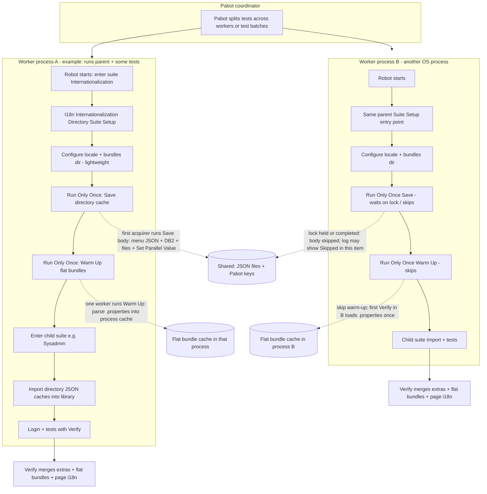

# Internationalization tests — cache loading, consumption, and parallel execution

This document complements [INTERNATIONALIZATION_UI_TEST_ARCHITECTURE.md](./INTERNATIONALIZATION_UI_TEST_ARCHITECTURE.md) with a **concrete execution flow**, how **`.properties`** relate to optimization, and how to interpret **merged logs** when using **Pabot** and **`--testlevelsplit`**.

**New developers:** start with [§0 New developer: configuring inputs](#i18n-new-developer-config) (what to set and where), then use [§7 Inputs: precedence](#7-inputs-where-they-are-consumed-and-precedence) for detail.

---

## 0. New developer: configuring inputs

Internationalization suites need the **same base URL, credentials, and browser setup** as other web tests (see your team’s `executor.py` / `--test-env` workflow). On top of that, the items below control **locale**, **`.properties` roots**, **menu/DB extras**, **verify-time ignore patterns**, and **whitelist files**.

### 0.1 Where values can be set (mechanisms)

| Mechanism | Typical use |
|-----------|-------------|
| **Process environment** | Strongest for explicit bundle-root overrides **`BUNDLES_DIR`** / **`WFM_RESOURCE_BUNDLES_DIR`**. Also used for **`I18N_LOCALE`**, **`I18N_MENU_JSON_PATHS`**, **`I18N_IGNORE_PATTERNS`** / **`I18N_IGNORE_PATTERNS_FILE`**, **`I18N_TEXT_WHITELIST_FILE`**, **`I18N_DB2_LOCALE_SOURCES_FILE`**, **`I18N_SHARED_CONTRACT_PATH`**, **`I18N_PABOT_CACHE_STAMP`**. |
| **Scoped env file** (e.g. [`.env_scoped/env_QA29_B0.env`](../.env_scoped/env_QA29_B0.env)) | Loaded when you run with a matching **`--test-env`**. Keep **`TEST_ENVIRONMENT`** here; explicit **`BUNDLES_DIR`** is now optional because bundles can be auto-discovered from the checked-in environment folder. |
| **Shell / CI** | `export BUNDLES_DIR=...` or `set BUNDLES_DIR=...` (Windows) before `python executor.py …` only when you want to override the checked-in bundle folder. |
| **Robot `--variable` / `-v`** | Passed through by **`executor.py`** to subprocesses: e.g. **`-v I18N_LOCALE:es_MX`**. Effective for **`${I18N_LOCALE}`** after env (see §7.1). |
| **Resource defaults** | [`resources/web/internationalization/i18n_pabot_shared.resource`](../resources/web/internationalization/i18n_pabot_shared.resource): default **`${I18N_LOCALE}`** (`en_US`), optional add-on **`@{I18N_MENU_JSON_PATHS}`** (empty by default), **`@{I18N_IGNORE_PATTERNS}`**, **`${I18N_TEXT_WHITELIST_FILE}`**, **`${I18N_LOCALE_SUITE_FALLBACK}`**, **`${I18N_SHARED_CONTRACT_PATH}`**. Treat as team defaults; override per machine via env. |
| **Suite `*** Variables ***`** | Override **`${I18N_MENU_JSON_PATHS}`** (as a list variable), **`@{I18N_IGNORE_PATTERNS}`**, **`${I18N_TEXT_WHITELIST_FILE}`**, or **`${I18N_LOCALE}`** for one suite without changing the shared resource. |
| **Optional contract YAML** | Default path [`test_data/i18n/shared_i18n_contract.yaml`](../test_data/i18n/shared_i18n_contract.yaml), or override with env **`I18N_SHARED_CONTRACT_PATH`**. **Only** **`menu_json_paths`** and **`db2_locale_sources_file`** are read from the file—not locale or bundle directory. |

When **`I18N_MENU_JSON_PATHS`** is unset, menu JSON files are auto-discovered from:
`test_data/environments/<TEST_ENVIRONMENT>/i18n_data/menu_json_files/*.json`
(or `TEST_ENV` alias), sorted by filename.

**Important:** The library first honors explicit env overrides (`BUNDLES_DIR` then `WFM_RESOURCE_BUNDLES_DIR`), then auto-discovers `test_data/environments/<TEST_ENVIRONMENT>/i18n_data/resource_bundles`. Setting a Robot variable **`${BUNDLES_DIR}`** alone still does **not** satisfy env override resolution unless your runner injects it into the **OS environment**.

### 0.2 Minimum configuration to run `tests/web/internationalization`

Do these first; without them, suite setup fails early or Verify cannot load bundles.

| Step | What to set | Notes |
|:----:|-------------|-------|
| 1 | Checked-in env bundles or override | Preferred default is `test_data/environments/<TEST_ENVIRONMENT>/i18n_data/resource_bundles`. If needed, env **`BUNDLES_DIR`** or **`WFM_RESOURCE_BUNDLES_DIR`** can override it; if both are set, **`BUNDLES_DIR`** wins (§7.2). |
| 2 | **`DB2_CONNECTION`** | JSON connection string (same as other DB-backed tests). Needed for **Save** path that loads DB2 extras and DB whitelist. |
| 3 | Web test env | **`--test-env`**, base URL, users—same as non-i18n PDV suites. |

### 0.3 Locale (`I18N_LOCALE`)

| You want… | Set… |
|-----------|------|
| CI / one-off override | Env **`I18N_LOCALE=es_MX`** or **`executor.py … --variable I18N_LOCALE:es_MX`** (or `-v`). |
| Repo default for all machines | Edit **`${I18N_LOCALE}`** in **`i18n_pabot_shared.resource`** (default **`en_US`**). |
| Rare third tier | Pass **`${I18N_LOCALE_SUITE_FALLBACK}`** into **`Configure I18n Suite Locale From Contract`** (used when env and **`${I18N_LOCALE}`** are empty). |

Precedence: **env → Robot `${I18N_LOCALE}` → suite_fallback → `en_US`** (§7.1). The contract YAML does **not** define locale.

### 0.4 Menu JSON paths (menu labels into the extra cache)

| Layer | How |
|-------|-----|
| **Env** | **`I18N_MENU_JSON_PATHS`** = comma-separated list of absolute paths to **`RWS.json`**, **`ESS.json`**, etc. (wins when set). |
| **Auto-discovery** | If env variable is unset: load `*.json` from `test_data/environments/<TEST_ENVIRONMENT>/i18n_data/menu_json_files` (or `<TEST_ENV>`). |
| **Suite** | Override **`${I18N_MENU_JSON_PATHS}`** in the suite’s **`*** Variables ***`** if paths differ per suite. |
| **Resource** | Optional add-on list in **`i18n_pabot_shared.resource`** (`@{I18N_MENU_JSON_PATHS}`), empty by default. |
| **Contract** | Optional **`menu_json_paths`** in **`shared_i18n_contract.yaml`** (merged after env and suite list; §7.3). |

### 0.5 Ignore patterns (regexes skipped during Verify)

| Layer | How |
|-------|-----|
| **Env** | **`I18N_IGNORE_PATTERNS_FILE`** → UTF-8 file, one regex per line (`#` comments allowed). **Or** **`I18N_IGNORE_PATTERNS`** with patterns joined by **`|||`** (triple pipe) if a pattern contains commas. |
| **Resource / suite** | **`@{I18N_IGNORE_PATTERNS}`** in **`i18n_pabot_shared.resource`** or overridden in a suite. Internationalization suites call **`Get Resolved I18n Ignore String Patterns    @{I18N_IGNORE_PATTERNS}`** so env + list merge (§7.5). |

### 0.6 Whitelist file (extra literals allowed on screen)

| Layer | How |
|-------|-----|
| **Env** | **`I18N_TEXT_WHITELIST_FILE`** → path to UTF-8 file, one literal per line. |
| **Resource / suite** | **`${I18N_TEXT_WHITELIST_FILE}`** in **`i18n_pabot_shared.resource`** or suite variables (env wins; §7.6). |

**DB-driven whitelist:** **Save** still loads employee-style literals from DB into cached JSON; that is separate from this file (see §7.6 and **`i18n_whitelist_db.resource`**).

### 0.7 DB2 query list (which SQL snippets run for extras)

| Layer | How |
|-------|-----|
| **Contract** | **`db2_locale_sources_file`** in **`shared_i18n_contract.yaml`** (path to a YAML listing queries). |
| **Env** | **`I18N_DB2_LOCALE_SOURCES_FILE`** overrides when resolving the config file. |
| **Default** | Packaged [`dev_utils/globalization/i18n/db2_locale_translation_sources.yaml`](../dev_utils/globalization/i18n/db2_locale_translation_sources.yaml) if neither contract nor env supplies a path (§7.4). |

Dedicated Robot helpers for DB whitelist literals live in [`resources/web/internationalization/i18n_whitelist_db.resource`](../resources/web/internationalization/i18n_whitelist_db.resource).

### 0.8 Optional: cache stamp and alternate contract path

| Variable | Purpose |
|----------|---------|
| **`I18N_PABOT_CACHE_STAMP`** | Force a fixed stamp for generated **`i18n_extra_*.json`** / **`i18n_whitelist_*.json`** filenames and Pabot parallel keys (e.g. CI build id). §7.7. |
| **`I18N_SHARED_CONTRACT_PATH`** | Absolute path to a YAML file with the same shape as **`shared_i18n_contract.yaml`** (`menu_json_paths`, `db2_locale_sources_file`). |

---

## 1. Is `.properties` bundle loading “optimized”?

**Partly — with an important limit.**

| Mechanism | Scope | What happens |
|-----------|--------|----------------|
| **`_flat_bundle_load_cache`** (class-level in `WebInternationalizationLibrary`) | **One Python process** | After the first successful `TranslationLoader.load_flat` for a key `(bundles_dir, locale, scope)`, later **`Verify Visible Texts Against Locale Bundles`** calls in the **same process** reuse the parsed flat map. **No re-read of every `.properties` file per test** in that worker. |
| **`Run Only Once    Warm Up I18n Flat Bundles For Locale`** (in [`tests/web/internationalization/__init__.robot`](../tests/web/internationalization/__init__.robot)) | **Whole Pabot job** | Only **one** worker runs the warm-up body; others skip (`Skipped in this item`). That worker’s cache is warmed **early**; others still load on **first Verify** in that process. |
| **Cross-worker** | **No shared RAM** | Each Pabot worker is a **separate OS process**. There is **no** single cluster-wide “load `.properties` once for all eight workers” unless you add an external mechanism (not in this repo). So you should expect **at most one parse per worker** for a given `(bundles_dir, locale, scope)` — typically **≤ `--processes` N**, not once for the entire fleet in RAM. |

**CI reality:** If you download bundles to one directory and point the run at it (**`BUNDLES_DIR`** or **`WFM_RESOURCE_BUNDLES_DIR`**), **paths are stable for the whole run**. Within each worker, **disk is read once** (then cached in memory). That matches “static for the entire app for this run”; it does **not** mean one parse total across all parallel processes unless you run **serially** (`--processes 1`).

**Correction vs older wording:** Menu/DB “extras” are coordinated by **one** `Run Only Once Save` (directory stamp). **`.properties`** are a **separate** cache from menu/DB JSON files.

---

## 2. Where data is loaded vs where tests consume it

### Menu JSON + DB2 extras + DB whitelist

1. **Load (heavy):** Parent suite — `Run Only Once    Save I18n Internationalization Directory Shared Cache Files` → writes JSON under `test_data/generated/` and registers Pabot parallel keys.
2. **Load (light per worker):** Each child suite setup — `Import I18n Internationalization Directory Caches Into Library` → reads JSON (or keys) into the library in **that process**.
3. **Consume:** `Verify Visible Texts Against Locale Bundles` merges **extras** when `merge_cached_extra_translation_sources=${True}` (your PDV flow).

### `.properties` bundles

1. **Optional early load:** `Run Only Once    Warm Up I18n Flat Bundles For Locale` (one worker only).
2. **Otherwise / other workers:** First **`Verify Visible Texts Against Locale Bundles`** in that process calls `_get_cached_flat_bundle_load` → loads from disk once, then cache hits.

### Page `i18n` (browser)

- Collected during **Verify** when `include_page_i18n=${True}` — not a pre-baked file cache like menu/DB.

---

## 3. Flow diagram (Pabot + directory suite)

Legend: **Solid** = work that consumes CPU/IO meaningfully; **Dashed** = coordination / skip.

**Waiting:** `Run Only Once` uses a **distributed lock** (PabotLib) so non-winning workers **block until the winner finishes** the inner keyword, then proceed (often with “Skipped in this item” for the body). That is why one `Run Only Once Save` can show a **long elapsed** time on a worker that **skipped** — it waited on the lock.

---

## 4. Why `output.xml` can show many repeated blocks (e.g. ~31) for one Suite Setup

Observed on a merged report (`generator="Rebot"` in `output.xml`), for example under:

`results/results_QA29_B0/output.xml`

Facts:

1. There is typically **one** top-level XML node named `I18n Internationalization Directory Suite Setup` in the merged file, but its **inner** steps (`Configure …`, `Run Only Once`, …) can **repeat many times** in sequence inside that node.
2. A grep of **`Warm Up I18n Flat Bundles For Locale`** as the `Run Only Once` argument appears **31 times** in that merged file — **not** “8 = `--processes`”.

**Why this is not the same as “Suite Setup ran 31 times in one Robot process”**

- **`--testlevelsplit`** changes how Pabot **slices** work: many **separate `robot` invocations** (or output fragments), each responsible for a subset of tests, each still walking from the **suite root** down. **Ancestor Suite Setup is part of each slice’s XML.**
- **`rebot` merge** combines those fragments into **one** report. Depending on Robot/Rebot version and merge rules, **setup bodies from each slice can appear concatenated** under the **same** parent keyword in the merged tree, which **inflates** how often you see `Configure I18n Suite Locale From Contract` and `Run Only Once` lines when searching the merged `output.xml`.
- The **expensive** work is still bounded by **`Run Only Once`**: **one** cluster-wide execution of **Save** and **one** of **Warm Up** (others wait or skip). **Lightweight** `Configure …` may still appear **many times** in the merged narrative because it is **outside** `Run Only Once` in [`__init__.robot`](../tests/web/internationalization/__init__.robot).

**How to get closer to “~8” parent setups in logs**

- Prefer **suite-level** parallelism for this folder: **`--processes 8`** **without** `--testlevelsplit`, so each worker tends to own **whole child suites** and parent setup aligns more closely with **one pass per worker** instead of **per test slice**.
- To measure **true** Save executions, search merged output for **child keywords** inside Save (e.g. `Export Cached Extra Translations To File`) or for **absence** of `Skipped in this item` on the Save `Run Only Once` winner — not raw counts of `Configure I18n Suite Locale From Contract` (191 occurrences can include **child suite** and **DataDriver `config_keyword`** calls).

---

## 5. Single child suite vs whole folder

| Run shape | Parent `__init__.robot` | Child suite |
|-----------|-------------------------|-------------|
| One file, e.g. `sysadmin.robot` | Loaded; same **Save / Import / Verify** pattern | Same as folder case |
| Folder `internationalization/` | Same | More child suites; **same** one coordinated Save |

---

## 6. Related files

| Topic | Location |
|--------|----------|
| Directory save / import keywords | [`resources/web/internationalization/i18n_pabot_shared.resource`](../resources/web/internationalization/i18n_pabot_shared.resource) |
| Parent suite setup | [`tests/web/internationalization/__init__.robot`](../tests/web/internationalization/__init__.robot) |
| Flat bundle cache + warm-up + verify | [`resources/common/library/WebInternationalizationLibrary.py`](../resources/common/library/WebInternationalizationLibrary.py) |
| Architecture overview | [INTERNATIONALIZATION_UI_TEST_ARCHITECTURE.md](./INTERNATIONALIZATION_UI_TEST_ARCHITECTURE.md) |

---

## 7. Inputs: where they are consumed and precedence

Robot variable names are case-insensitive; the repo uses `I18N_LOCALE` (not `i18n_LOCALE`).

### 7.1 `I18N_LOCALE` (locale tag, e.g. `es_MX`)

**Resolved by:** `Get Resolved I18n Locale` → `Configure I18n Suite Locale From Contract` sets `${I18N_LOCALE}`.

**Precedence (first match wins):**

| Order | Source |
|------:|--------|
| 1 | Environment variable **`I18N_LOCALE`** |
| 2 | Robot variable **`${I18N_LOCALE}`** (e.g. `executor.py … --variable I18N_LOCALE:en_US`, or default in [`i18n_pabot_shared.resource`](../resources/web/internationalization/i18n_pabot_shared.resource)) |
| 3 | **`suite_fallback`** argument to `Get Resolved I18n Locale` (e.g. `${I18N_LOCALE_SUITE_FALLBACK}` from `Configure I18n Suite Locale From Contract`) |
| 4 | Literal **`en_US`** |

The shared contract YAML does **not** supply locale (optional `menu_json_paths` / `db2_locale_sources_file` only).

**Consumed for:** menu JSON label choice, DB2 locale queries, bundle flat-load key `(bundles_dir, locale, scope)`, and **`Verify Visible Texts Against Locale Bundles`** first argument.

---

### 7.2 `.properties` bundle root (`bundles_dir`)

**Resolved only from the process environment** (Robot variables and the shared contract YAML are **not** read for this path).

| Name | What it is |
|------|------------|
| **`BUNDLES_DIR`** | Env var read **first** by `Get Resolved I18n Bundles Dir` (explicit override). |
| **`WFM_RESOURCE_BUNDLES_DIR`** | Env var read **second** if `BUNDLES_DIR` is unset or empty (explicit override). |
| **`test_data/environments/<TEST_ENVIRONMENT>/i18n_data/resource_bundles`** | Default checked-in bundle root read **third** when env overrides are absent. |

There is **no** `I18N_BUNDLES_DIR` and **no** suite Robot fallback for bundle root in the library beyond the environment-folder default: if neither env override nor the checked-in folder exists, resolution raises **`ValueError`**.

**Precedence for `Get Resolved I18n Bundles Dir`:**

| Order | Source |
|------:|--------|
| 1 | Env **`BUNDLES_DIR`** |
| 2 | Env **`WFM_RESOURCE_BUNDLES_DIR`** |
| 3 | `test_data/environments/<TEST_ENVIRONMENT>/i18n_data/resource_bundles` |
| 4 | **`ValueError`** if no source resolves |

**During `Verify Visible Texts Against Locale Bundles`**, bundle root is resolved by **`_resolve_bundles_dir_for_verify`**:

| Order | Source |
|------:|--------|
| 1 | Keyword argument **`bundles_dir=`** if passed (explicit override) |
| 2 | Process default from **`Set Default I18n Bundles Dir For Visible Text Verify`** (set by **`Configure I18n Bundles Dir From Contract`** in i18n suite setup) |
| 3 | **`Get Resolved I18n Bundles Dir`** (env override → environment-folder auto-discovery) |

**Recommendation:** keep bundle files under `test_data/environments/<TEST_ENVIRONMENT>/i18n_data/resource_bundles` for normal runs. Use **`BUNDLES_DIR`** or **`WFM_RESOURCE_BUNDLES_DIR`** only as explicit overrides. If both are set, **`BUNDLES_DIR`** wins.

---

### 7.3 Menu JSON paths

**Merged by:** `Get Merged Menu Json Paths For I18n Save` (used when saving the directory cache).

**Order (all merged, then de-duplicated in order):**

1. Paths from env **`I18N_MENU_JSON_PATHS`** (comma-separated), or when unset, auto-discovered
  `test_data/environments/<TEST_ENVIRONMENT>/i18n_data/menu_json_files/*.json`
2. **`suite_menu_paths`** passed into the keyword (internationalization flows pass **`${I18N_MENU_JSON_PATHS}`** from the suite)
3. **`menu_json_paths`** from the shared contract YAML (when present)
4. Again **`${I18N_MENU_JSON_PATHS}`** from [`i18n_pabot_shared.resource`](../resources/web/internationalization/i18n_pabot_shared.resource) defaults

**Contract path:** `I18N_SHARED_CONTRACT_PATH` env → default `test_data/i18n/shared_i18n_contract.yaml`.

**Consumed for:** `AddTranslationSourcesFromMenuJsonFiles` during **Save** (labels into extra cache).

---

### 7.4 DB2 translation YAML (which queries run)

**Resolved when loading DB2 extras:** `resolve_db2_locale_sources_path` in [`dev_utils/globalization/i18n/db2_locale_sources.py`](../dev_utils/globalization/i18n/db2_locale_sources.py), invoked from **`Add Translation Sources From Db2 For Locale`** with optional `sources_config_path` from the resource.

| Order | Source |
|------:|--------|
| 1 | Non-empty **`sources_config_path`** passed from Robot (resource passes result of **`Get Db2 Locale Sources Path From I18n Contract`**, i.e. contract key **`db2_locale_sources_file`** when set) |
| 2 | Env **`I18N_DB2_LOCALE_SOURCES_FILE`** |
| 3 | Packaged default **`db2_locale_translation_sources.yaml`** |

**Also required:** **`DB2_CONNECTION`** (and normal test env / credentials) for DB access.

---

### 7.5 Ignore regex list (`ignore_string_patterns` on Verify)

**Built by:** `Get Resolved I18n Ignore String Patterns` (internationalization suites pass **`@{I18N_IGNORE_PATTERNS}`** as the last segment).

**Merge order (de-duplicated, first-seen order kept):**

1. Lines from file path in env **`I18N_IGNORE_PATTERNS_FILE`** (UTF-8; `#` full-line comments skipped)
2. Segments from env **`I18N_IGNORE_PATTERNS`**, split on **`|||`** (triple pipe) so patterns can contain commas
3. Positional arguments from Robot (defaults: **`@{I18N_IGNORE_PATTERNS}`** in [`i18n_pabot_shared.resource`](../resources/web/internationalization/i18n_pabot_shared.resource))

Each pattern is used with `re.search`; matching **visible strings are skipped** (not matched against bundles).

**Override:** set env vars, change the resource list, or pass a different list into `Get Resolved I18n Ignore String Patterns` / **`Verify`** in a specific suite.

---

### 7.6 Whitelist literals (employee names, etc.)

**Optional file path for Verify:** env **`I18N_TEXT_WHITELIST_FILE`** wins over Robot **`${I18N_TEXT_WHITELIST_FILE}`** (default empty in [`i18n_pabot_shared.resource`](../resources/web/internationalization/i18n_pabot_shared.resource)). Suites call **`Get Resolved I18n Text Whitelist File Path`** and pass **`text_whitelist_file=`** into **`Verify Visible Texts Against Locale Bundles`**.

**Merged inside Verify** by **`_build_effective_text_whitelist`** when `merge_cached_text_whitelist=${True}` (default in your suites unless changed).

| Order | Source |
|------:|--------|
| 1 | Lines from **`text_whitelist_file`** (if Verify arg non-empty) |
| 2 | **`text_whitelist`** inline argument on Verify |
| 3 | Class-level cache from **`Set Cached I18n Text Whitelist`** / import from **Save** path (**DB-driven whitelist** serialized with extras) when **`merge_cached_text_whitelist=True`** |

Internationalization **Save** loads DB whitelist via **`Get I18n Text Whitelist From Db`** and persists it; **Import** restores it into the same class-level cache Verify merges.

**Optional per-suite:** keywords in [`i18n_whitelist_db.resource`](../resources/web/internationalization/i18n_whitelist_db.resource) can build extra lists passed as **`text_whitelist=`** on Verify.

---

### 7.7 Pabot cache stamp (menu/DB JSON filenames)

| Order | Source |
|------:|--------|
| 1 | Env **`I18N_PABOT_CACHE_STAMP`** (if set, all suites use this stamp for parallel keys / filenames) |
| 2 | Default from **`Get I18n Web Directory Shared Cache Stamp`** (hash + resolved locale) |

---

## 8. Prerequisites checklist (internationalization under `executor.py`)

Full narrative for each row: [§0 New developer: configuring inputs](#i18n-new-developer-config).

Minimal items to run `tests/web/internationalization` successfully:

| Prerequisite | Typical setup |
|--------------|----------------|
| **Test environment** | `--test-env QA29_B0` (or your env); scoped `.env_scoped/env_<NAME>.env` merged with credentials as for any web test |
| **Bundle root (required)** | Checked-in `test_data/environments/<TEST_ENVIRONMENT>/i18n_data/resource_bundles` by default, or explicit env override via **`BUNDLES_DIR`** / **`WFM_RESOURCE_BUNDLES_DIR`** (§0.2, §7.2). |
| **Locale** | Env **`I18N_LOCALE`**, or **`--variable I18N_LOCALE:…`**, or resource default **`en_US`**; optional **`${I18N_LOCALE_SUITE_FALLBACK}`** (§0.3, §7.1) |
| **Menu JSON files** | Auto-discovered from `test_data/environments/<TEST_ENVIRONMENT>/i18n_data/menu_json_files` when env `I18N_MENU_JSON_PATHS` is unset; can be supplemented/overridden by suite `${I18N_MENU_JSON_PATHS}`, resource `@{I18N_MENU_JSON_PATHS}`, and/or contract `menu_json_paths` (§0.4, §7.3) |
| **Ignore patterns (optional)** | Env **`I18N_IGNORE_PATTERNS_FILE`** and/or **`I18N_IGNORE_PATTERNS`** (`|||` split), plus resource/suite **`@{I18N_IGNORE_PATTERNS}`** (§0.5, §7.5) |
| **Whitelist file (optional)** | Env **`I18N_TEXT_WHITELIST_FILE`** or Robot **`${I18N_TEXT_WHITELIST_FILE}`** in resource/suite (§0.6, §7.6) |
| **DB2** | **`DB2_CONNECTION`**; optional **`I18N_DB2_LOCALE_SOURCES_FILE`** or contract **`db2_locale_sources_file`** (§0.7, §7.4) |
| **Browser / app** | Same as other PDV web tests (base URL, users, etc.) |

Optional: **`I18N_SHARED_CONTRACT_PATH`** (alternate YAML for menu paths + DB2 config only); **`I18N_PABOT_CACHE_STAMP`** to pin cache filenames in CI (§0.8, §7.7).
