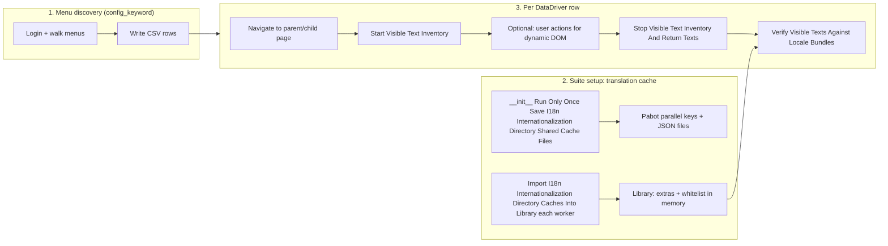

# WFM Web internationalization (i18n) UI tests — generic architecture

This document describes the **generic internationalization (i18n) UI test flow** used in this repository: how menu discovery, data-driven execution, translation allow-lists, and DOM text inventory fit together. It is written for **developers onboarding to the approach** and for **LLM agents** that need a compact, accurate mental model when enhancing suites, resources, or `WebInternationalizationLibrary`.

**Note:** *Globalization* (g11n) is the business goal; *internationalization* (i18n) is the engineering practice these tests exercise (externalized strings, locale bundles, and runtime `i18n`).

For broader i18n strategy context (layers, pseudo-localization, challenges), see [GLOBALIZATION_RnD.md](./GLOBALIZATION_RnD.md).

For **cache loading vs test consumption**, **`.properties` optimization across processes**, **why merged Pabot/Rebot `output.xml` can show many repeated setup blocks**, and **input precedence (`I18N_LOCALE`, bundle dir, menu paths, ignore patterns, whitelist)** see [INTERNATIONALIZATION_I18N_CACHE_EXECUTION_FLOW.md](./INTERNATIONALIZATION_I18N_CACHE_EXECUTION_FLOW.md), especially **§0 (new developer configuration)** and **§7 (precedence)**.

---

## Goals of this document

| Audience | Use |
|----------|-----|
| **Developers** | Understand the pipeline end-to-end, where to add navigation steps, and which keywords participate in “allow-list vs screen text” matching. |
| **LLM agents** | Load this file (or a short excerpt) as context before editing `tests/web/internationalization/*.robot`, `resources/web/internationalization/*.resource`, or `resources/common/library/WebInternationalizationLibrary.py`. |

---

## Pre-requisites

Before running suites under `tests/web/internationalization/`:

1. Ensure checked-in bundle files exist under `test_data/environments/<TEST_ENVIRONMENT>/i18n_data/resource_bundles` for the target `--test-env`. Optionally set process environment **`BUNDLES_DIR`** or **`WFM_RESOURCE_BUNDLES_DIR`** as an explicit override.
2. Ensure **`DB2_CONNECTION`** and normal web test credentials / **`--test-env`** are configured.
3. Place menu JSON files under `test_data/environments/<TEST_ENVIRONMENT>/i18n_data/menu_json_files` (auto-discovered at runtime). Optionally set **`I18N_MENU_JSON_PATHS`** (comma-separated absolute paths) to override discovery.
4. Optionally set **`I18N_LOCALE`**, ignore-pattern env vars, **`I18N_TEXT_WHITELIST_FILE`**, and contract overrides as described in [INTERNATIONALIZATION_I18N_CACHE_EXECUTION_FLOW.md §0](./INTERNATIONALIZATION_I18N_CACHE_EXECUTION_FLOW.md#i18n-new-developer-config).

---

## High-level idea

We avoid maintaining a separate locator map for every label. Instead we:

1. **Discover** which screens to visit (per user role / module) and record them as **CSV rows** (DataDriver input).
2. **Load** an **allow-list** from **`.properties` bundles** (cached **per Python process** after first load), optional **page `i18n`**, plus **menu JSON** and **DB2** strings via a **Pabot-safe** JSON handoff (**one coordinated `Run Only Once` save** for the `internationalization` folder, **import on each worker**). Details: [INTERNATIONALIZATION_I18N_CACHE_EXECUTION_FLOW.md](./INTERNATIONALIZATION_I18N_CACHE_EXECUTION_FLOW.md).
3. On each row, **navigate** to the target menu screen, then **collect all user-relevant text from the live DOM** (including text inside hidden-but-present widgets such as closed dropdowns), using browser **JavaScript** injected from the library.
4. **Compare** collected strings against the merged allow-list. **Any unique visible string that cannot be justified** by bundles + extras + optional whitelist rules **fails** the test.

Primary implementation: `resources/common/library/WebInternationalizationLibrary.py` (Robot library `WebInternationalizationLibrary`).

---

## End-to-end flow (reference: `SYSADMIN` PDV suite)

The suite `tests/web/internationalization/sysadmin.robot` is a concrete example for **one user key** (`SYSADMIN`), **one module** (`rws`), and a chosen **locale** (e.g. `en_US`). The same pattern applies to other i18n suites that use the PDV DataDriver dispatch resources.

### 1. DataDriver `config_keyword`: login, discover menus, emit CSV

- DataDriver is configured with `config_keyword=Generate PDV Child Menu CSV For Environment And Return Config`.
- That keyword forwards suite variables (user key, module, locale) into `Generate PDV Child Menu CSV For Environment With Params And Return Config` in `resources/web/pdv/pdv_menu_datadriver_dispatch.resource`.
- That logic **logs in** (as part of discovery), walks **MyWork** or **non-MyWork** navigation depending on environment `MYWORK`, and **writes a CSV** of **parent / child / page** rows. The returned config points DataDriver at that **generated file**.
- **Purpose:** One automated pass builds the **test matrix** (which screens to open) for the given user and module, instead of hand-maintaining a list per release.

### 2. Data-driven i18n test per CSV row

- Each DataDriver row becomes one test case instance (e.g. “Verify I18n For RWS Child Menu Page (SYSADMIN) - …”).
- The template opens the menu path for `parent_menu` / `child_menu`, then runs the **visible text inventory** and **verify** steps (see below).

### 3. Load translations into the library cache (once per run for the folder; parallel-safe)

**Problem:** Menu JSON and DB2 reads are relatively expensive; under **Pabot** each worker is a **separate process**, so in-memory class-level caches are **not** shared by default.

**Approach** (see `resources/web/internationalization/i18n_pabot_shared.resource` and `tests/web/internationalization/__init__.robot`):

- **`tests/web/internationalization/__init__.robot`** (parent suite): **`Run Only Once    Save I18n Internationalization Directory Shared Cache Files`** — one coordinated process per full run clears the extra cache, loads **menu JSON** and **DB2** strings, exports **`i18n_extra_<stamp>.json`**, saves **`i18n_whitelist_<stamp>.json`**, and registers Pabot keys **`I18N_WHITELIST_FILE_<stamp>`** / **`I18N_EXTRA_EXPORT_FILE_<stamp>`**. **`stamp`** comes from **`Get I18n Web Directory Shared Cache Stamp`**: env **`I18N_PABOT_CACHE_STAMP`** if set, otherwise a fixed namespace hash plus the **resolved locale** (so sequential CI jobs for different locales do not reuse the same filenames).
- **Each child suite** (e.g. `sysadmin.robot`): **`Import I18n Internationalization Directory Caches Into Library`** (every worker, **not** wrapped in `Run Only Once`) so workers resolve the same stamp and **`Get Parallel Value For Key`** then import JSON. If parallel keys are missing (plain `robot` without Pabot), the resource falls back to loading live sources in-process.
- **Suites outside** `tests/web/internationalization/` that use this resource (e.g. examples) keep their own **`Run Only Once    Save I18n Shared Cache Files`** with per-suite stamp (hash of **`${SUITE_SOURCE}`**) when they do not run under the directory `__init__.robot`.

Relevant library keywords:

- `Add Translation Sources From Menu Json Files` — `displayLabelLangMap` strings from WFM menu JSON files; tagged in cache as `menu_json:<filename>`.
- `Add Translation Sources From Db2 For Locale` — `LANG_MAPPING` and `RFX_USER_TRANSLATIONS` for the locale (uses `DB2_CONNECTION`).
- `Clear Extra Translation Sources For Visible Text Verify` — reset class-level extra cache when switching locale/build or between intentional full reloads.
- `Export Cached Extra Translations To File` / `Import Cached Extra Translations From File` — serialize and restore the extra cache for Pabot workers.

### 4. Open the screen from the CSV row

- `Verify PDV Child Menu Page For Datadriven Row On Web` dispatches to MyWork or non-MyWork navigation keywords so the **correct shell** reaches the **target child menu page** for that row.
- **Future extension:** Insert additional UI steps *after* navigation if a screen only materializes part of the DOM after interaction; the inventory (next steps) is designed to **keep observing** the DOM until stopped.

### 5–6. DOM text inventory: start, (optional interaction), stop

**`Start Visible Text Inventory`**

- Injects JavaScript that:
  - Walks the DOM for **visible** text nodes under a visibility heuristic (skips `script` / `style`, respects `hidden`, `aria-hidden`, `display:none`, etc.).
  - Runs **extra collectors**: native `<select>` option labels (not `value`), ARIA roles (`option`, `menuitem`, tabs, …) including **off-screen / closed** popups, `placeholder` and `title`, and optional legacy Angular/Bootstrap dropdown heuristics.
  - Attaches a **`MutationObserver`** on `document.body` so **new nodes** (dynamic dialogs, lazy panels) are collected as they appear.
- **Purpose:** Capture “what the user could see or what is already in the DOM for controls like dropdowns,” not only a static snapshot at one instant.

**Optional:** `Get Collected Visible Texts Without Stopping` — peek without disconnecting the observer.

**`Stop Visible Text Inventory And Return Texts`**

- Disconnects the observer, returns the **distinct string list**, and keeps **truncated `outerHTML` snippets** per string for optional mismatch debugging (`log_unmatched_dom_context=${True}` on verify).

### 7. Verify against bundles + extras + filters

**`Verify Visible Texts Against Locale Bundles`**

- Loads **flat** locale strings from **`TranslationLoader`** using the resolved bundle root (same precedence as `Get Resolved I18n Bundles Dir` / suite setup `Configure I18n Bundles Dir From Contract`). `.properties` for the given `locale` and `scope` (default `web`).
- Optionally merges **`Get Page I18n String Values`** (recursive walk of global `i18n` in the page) into the allow-list.
- Optionally merges **class-level extra cache** (menu JSON + DB2) when `merge_cached_extra_translation_sources=${True}`.
- Runs analysis in `dev_utils.globalization.i18n.visible_text` (see `analyze_visible_texts_against_flat_load`): dedupe, optional numeric/date noise skipping, regex ignores, **text whitelist** (file, inline, or cached), date-suffix relaxation, etc.
- **Fails** the keyword (and thus the test) if any **unique** string remains unmatched after rules.
- **Arguments:** Positional **`locale`** and **`visible_texts`** only—no bundle path on the test (same spirit as menu/DB: suite setup prepares sources). **`Configure I18n Bundles Dir From Contract`** resolves the app **`.properties`** root from env override **`BUNDLES_DIR`** / **`WFM_RESOURCE_BUNDLES_DIR`** or auto-discovery under `test_data/environments/<TEST_ENVIRONMENT>/i18n_data/resource_bundles`, then calls **`Set Default I18n Bundles Dir For Visible Text Verify`**. Optional named **`bundles_dir=`** exists only for rare overrides. Parsed **`.properties`** live in **`_flat_bundle_load_cache`** keyed by **`(resolved_dir, locale, scope)`**. Separate from the **menu/DB extra** cache (suite setup / imports).
- **Logging (default):** One **`I18N | allow-list SUMMARY`** line reports bundle stats, page `i18n`, menu/DB extra cache row counts, and the **merged** allow-list key/distinct-value totals. **`I18N STATS`** is a single compact line. The first bundle **cache miss** logs file count at INFO and each `.properties` path at DEBUG. Pass **`verbose_allow_list_logs=${True}`** on Verify to restore per-step `translate-metrics` and the long bundle path list in the coverage block.

Typical arguments in `sysadmin.robot`: `include_page_i18n=${True}`, `skip_numeric_looking=${True}`, `ignore_string_patterns=${I18N_IGNORE_PATTERNS}`, `try_date_suffix_relaxation=${True}`, `strip_trailing_ratio_time=${True}`.

---

## Flow diagram

---

## Important `WebInternationalizationLibrary` keywords (cheat sheet)

| Keyword | Role in the generic flow |
|--------|---------------------------|
| **`Start Visible Text Inventory`** | Inject DOM walk + `MutationObserver`; begin collecting visible and widget-associated strings (select options, ARIA menus, placeholders, etc.). |
| **`Stop Visible Text Inventory And Return Texts`** | Stop observing; return distinct strings; retain element ref snippets for debug. |
| **`Get Collected Visible Texts Without Stopping`** | Snapshot without stopping (advanced / debugging). |
| **`Verify Visible Texts Against Locale Bundles`** | Merge `.properties` (+ optional `i18n` + optional extra cache + whitelist), compare collected strings, **fail** on unmatched. |
| **`Get Page I18n String Values`** | Collect string leaves from global `i18n` in the browser; used inside Verify when `include_page_i18n=${True}`. |
| **`Add Translation Sources From Menu Json Files`** | Append menu label translations to the **extra** cache (tagged by source file). |
| **`Add Translation Sources From Db2 For Locale`** | Append DB2 translation strings for the locale to the **extra** cache. |
| **`Clear Extra Translation Sources For Visible Text Verify`** | Clear extra cache buffers (suite reset / locale switch). |
| **`Set Extra Translation Cache Store Distinct Only`** / **`Set Extra Translation Cache Dedupe Case Sensitive`** | Control how many rows are stored when loading extras. |
| **`Export Cached Extra Translations To File`** / **`Import Cached Extra Translations From File`** | Pabot: persist extras for worker import. |
| **`Set Cached I18n Text Whitelist`** / **`Import Cached I18n Text Whitelist From File`** | Literals that are **not** validated against bundles (e.g. employee names); merged with verify args when `merge_cached_text_whitelist=${True}`. |
| **`Log I18n Bundle And Page Diagnostics`** | Diagnostics only: list modules, loaded `.properties`, sample `i18n`—useful when debugging allow-list size. |
| **`Configure I18n Translation Debug Log`** / **`Write I18n Translation Sources To File`** | Write TSV of merged allow-list sources for offline diff (env `I18N_TRANSLATION_DEBUG_LOG` also supported). |
| **`Dump Visible Text Check Result As Json`** | Same matching rules as Verify but returns JSON **without** failing (exploratory / reporting). |
| **`Get Resolved I18n Bundles Dir`** / **`Configure I18n Bundles Dir From Contract`** | Resolve bundle root from env override **`BUNDLES_DIR`** / **`WFM_RESOURCE_BUNDLES_DIR`** or auto-discovery under `test_data/environments/<TEST_ENVIRONMENT>/i18n_data/resource_bundles`; configure registers the library process default for Verify. |
| **`Get Menu Json Paths From Environment`** / **`Get Menu Json Paths From I18n Contract`** / **`Get Merged Menu Json Paths For I18n Save`** | Resolve menu paths from env `I18N_MENU_JSON_PATHS` or auto-discovery under `test_data/environments/<TEST_ENVIRONMENT>/i18n_data/menu_json_files`, then merge with suite + contract + resource lists for **`Save I18n Shared Cache Files`** / directory save. |
| **`Get I18n Web Directory Shared Cache Stamp`** | Shared **stamp** for all suites under `tests/web/internationalization/` (locale-aware unless **`I18N_PABOT_CACHE_STAMP`** is set). |
| **`Get Db2 Locale Sources Path From I18n Contract`** | Optional per-job DB2 YAML override (`db2_locale_sources_file` in contract). |
| **`Warm Up I18n Flat Bundles For Locale`** | Pre-parse `.properties` into the same class-level cache used by Verify (optional suite-setup perf / early errors). Positional: ``${I18N_LOCALE}`` only. |
| **`Set Default I18n Bundles Dir For Visible Text Verify`** / **`Clear Default I18n Bundles Dir For Visible Text Verify`** | Process-wide bundle root cache (set by **`Configure I18n Bundles Dir From Contract`**); Verify resolves automatically without a bundle argument. |

**Robot pitfall:** Pass the list from Stop as **`${visible_texts}`** (second positional to Verify, after **`${I18N_LOCALE}`**), **not** `@{visible_texts}`—otherwise the library may treat a string as iterable characters.

---

## Visible-text normalization quick reference

The matcher in `dev_utils/globalization/i18n/visible_text.py` generates fallback candidates from
captured UI text before final unmatched reporting. Use this table as a compact debugging aid.

| Input | Normalized candidates |
|------|------------------------|
| `Data 99` | `Data 99`, `Data` |
| `25 Days` | `25 Days`, `Days` |
| `Count: 12` | `Count: 12`, `Count` |
| `10 Count 12` | `10 Count 12`, `Count 12`, `10 Count`, `Count` |
| `06/07/2026 (Week 22 )` | `06/07/2026 (Week 22 )`, `Week` |
| `Week 5 : 02/08/2026 - 02/14/2026` | `Week 5 : 02/08/2026 - 02/14/2026`, `Week` |
| `6- Start : 05/31/2026` | `6- Start : 05/31/2026`, `Start` |
| `07:15am - 06:15pm` | `07:15am - 06:15pm`, `am`, `pm`, `a`, `p`, `am and pm`, `AM AND PM`, ... |
| `Associate Chart:` | `Associate Chart:`, `Associate Chart` |
| `Week of Mar 15, 2026` | `Week of Mar 15, 2026`, `Week of Mar 15`, `Week of Mar` |
| `Scheduled / 37:30` (when `strip_trailing_ratio_time=True`) | `Scheduled` |
| `Store – 1` (for ignore-regex matching) | `Store - 1` |

Notes:
- Whitelist matching also normalizes NBSP/zero-width characters and collapses whitespace clusters.
- Matching uses `strip` / `case_sensitive` flags; case-insensitive mode compares `casefold()` values.

---

## Pabot and `WebInternationalizationLibrary` scope

- Library **`ROBOT_LIBRARY_SCOPE = TEST`**: keyword state is per test unless using **class-level** caches (extras, whitelist) intentionally shared.
- **Class-level** caches back **menu/DB extras** and **cached whitelist**; the **Pabot shared resource** exists so all processes see **consistent** data without each worker hitting DB/menu repeatedly.
- **`.properties` flat load cache (per process):** `Verify Visible Texts Against Locale Bundles`, `Dump Visible Text Check Result As Json`, and `Write I18n Translation Sources To File` reuse a cached `TranslationLoader.load_flat` result keyed by `(bundles_dir, locale, scope)`. Call **`Clear I18n Flat Bundle Load Cache`** if the same worker must reload bundles after disk changes. Optional **`Warm Up I18n Flat Bundles For Locale`** forces an early load (same cache).

---

## Shared contract, DB2 extensibility, multi-suite CI

**Contract file:** `test_data/i18n/shared_i18n_contract.yaml` is optional for **`menu_json_paths`** and **`db2_locale_sources_file`** only (not locale or bundle directory). Merge order for menu paths includes env **`I18N_MENU_JSON_PATHS`** (or env-folder auto-discovery), suite list, contract paths, and resource add-ons—see **`Get Merged Menu Json Paths For I18n Save`**. Override the file with **`I18N_SHARED_CONTRACT_PATH`**.

**DB2 locale strings:** Query definitions live in `dev_utils/globalization/i18n/db2_locale_translation_sources.yaml` (add a `queries` row for a new table). Override the file with env **`I18N_DB2_LOCALE_SOURCES_FILE`**, contract key **`db2_locale_sources_file`**, or keyword **`sources_config_path`** on **`Add Translation Sources From Db2 For Locale`**.

**Running many suites in one command:** `python executor.py tests/web/internationalization/ ... --testlevelsplit --processes N` runs all suites under that folder in one Pabot session; `--testlevelsplit` assigns individual **tests** across workers. **One** process runs **`Run Only Once    Save I18n Internationalization Directory Shared Cache Files`** from **`__init__.robot`** (parent suite setup); child suites only **import**. Locale for CI: pass **`--variable I18N_LOCALE:…`** (or `export I18N_LOCALE=…`); see `Get Resolved I18n Locale` in the library for precedence (contract YAML is not used for locale).

**Optional shared stamp override:** Set env **`I18N_PABOT_CACHE_STAMP`** (e.g. build id) so **`Get I18n Web Directory Shared Cache Stamp`** returns that value instead of the default locale-derived stamp.

**Directory-level setup (Robot standard):** `tests/web/internationalization/__init__.robot` runs **`I18n Internationalization Directory Suite Setup`**: configure locale/bundles, **`Run Only Once    Save I18n Internationalization Directory Shared Cache Files`**, then **`Run Only Once    Warm Up I18n Flat Bundles For Locale`**. Runs when you execute the folder or any child `*.robot` under it (parent setup runs first).

**Ad-hoc bootstrap:** **`Run I18n Shared Cache Bootstrap Job`** (same directory save + warm-up, no `Run Only Once`) is for a **single-process** CI pre-step or tooling; avoid running it in parallel workers without coordination.

**Non–DataDriver i18n suites under `tests/web/internationalization/`:** Use the same **`Import I18n Internationalization Directory Caches Into Library`** pattern after **`Configure … From Contract`**. Suites **outside** that directory that use the resource keep **`Run Only Once    Save I18n Shared Cache Files`** + **`Import I18n Caches Into Library`** when they have no parent `__init__.robot` save.

---

## Reading a run log or `output.xml`

For a representative run (example command in `sysadmin.robot` comments), open the generated **`output.xml`** or HTML log under the chosen **`--results-dir`**.

Search or filter log lines prefixed with:

- **`I18N |`** — general i18n messages (inventory start, bundle paths, merge metrics).
- **`I18N STATS | matching`** — counts: `unique_checked`, `unique_matched`, `unique_unmatched`, whitelist skips, numeric/regex filters.
- **`I18N UNMATCHED`** — strings that caused failure (with optional **`I18N | dom_context`** if enabled).

This matches the pipeline: **inventory list length** → **verify input list length** → **STATS** → pass/fail.

---

## File map (quick reference)

| Area | Location |
|------|----------|
| Directory parent / optional bootstrap gate | `tests/web/internationalization/__init__.robot` |
| Example suite (one user / module) | `tests/web/internationalization/sysadmin.robot` |
| DataDriver dispatch + menu CSV generation | `resources/web/pdv/pdv_menu_datadriver_dispatch.resource` |
| Pabot-safe cache save/import | `resources/web/internationalization/i18n_pabot_shared.resource` |
| DOM inventory + verify | `resources/common/library/WebInternationalizationLibrary.py` |
| Matching logic / coverage report | `dev_utils/globalization/i18n/visible_text.py` |
| Bundle loading | `dev_utils/globalization/i18n/loader.py` |
| DB2 locale query list (extend here) | `dev_utils/globalization/i18n/db2_locale_translation_sources.yaml` |
| Optional shared defaults (contract) | `test_data/i18n/shared_i18n_contract.yaml` |
| Optional single-process cache build (CI / tooling) | `Run I18n Shared Cache Bootstrap Job` in `resources/web/internationalization/i18n_pabot_shared.resource` |

---

## Enhancing this approach (for agents and developers)

- **New role or module:** Add or copy a suite with the right `PDV_DATADRIVER_MENU_USER_KEY`, `PDV_DATADRIVER_MENU_MODULE`, and the standard **`Configure … From Contract`** + menu JSON path pattern (env-folder auto-discovery, env **`I18N_MENU_JSON_PATHS`**, and/or contract **`menu_json_paths`**; optional resource add-ons in **`@{I18N_MENU_JSON_PATHS}`**). **Locale** comes from env / Robot / resource (not the contract). **Bundle root** comes from env override **`BUNDLES_DIR`** / **`WFM_RESOURCE_BUNDLES_DIR`** or checked-in environment-folder auto-discovery.
- **Stricter or looser matching:** Adjust `ignore_string_patterns`, whitelist files, `skip_numeric_looking`, `try_date_suffix_relaxation`, `strip_trailing_ratio_time` on **`Verify Visible Texts Against Locale Bundles`**.
- **Dynamic screens:** After navigation, add steps **between** **`Start Visible Text Inventory`** and **`Stop Visible Text Inventory And Return Texts`** so the observer captures late-rendered DOM.
- **Parallelism:** Under `tests/web/internationalization/`, keep **one** **`Run Only Once    Save I18n Internationalization Directory Shared Cache Files`** in **`__init__.robot`** and **`Import I18n Internationalization Directory Caches Into Library`** on every child suite worker; do not duplicate heavy DB/menu loads per test or per role suite file.

This document should be enough context to extend the generic i18n UI flow without re-reading the entire codebase.
