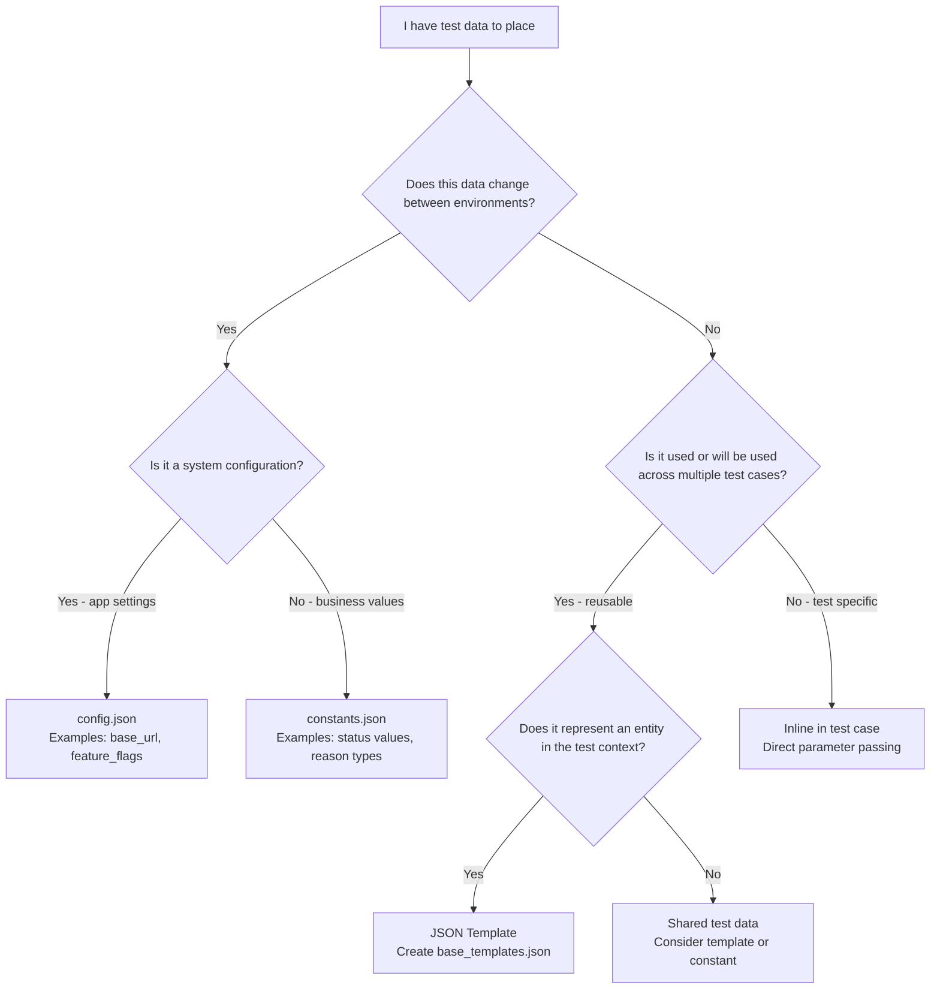

# Test Data Placement Decision Guide for Testers

## Overview

This guide helps new testers make informed decisions about where to place test data in the WFM test automation framework. Our framework provides multiple layers of test data management, each serving different purposes and use cases.

## 📊 Quick Reference: Data Classification

Test data in our framework falls into 4 main categories (as outlined in [DATA_ANALYSIS.md](DATA_ANALYSIS.md)):

| Category | Description | Examples | Storage Location |
|----------|-------------|----------|------------------|
| **Configuration** | Environment-specific settings that change by deployment | `base_url`, `mywork_enabled`, `date_format`, `rta_enabled` | `config.json` |
| **Logical Constants** | Business enums/ logical constants that may vary by environment | `RequestStatus.APPROVED`, `DayOffReasonType.UNPAID`,`RequestStatus.PENDING` | `constants.json` |
| **Test-Specific Data** | Values specific to individual test scenarios | Duration, relative dates, custom reasons | Templates or inline in tests |
| **User Data** | Information related to users that may vary by environment | SM1_STORE1, SYSADMIN user and its attributes | .env files under USER_CREDENTIALS |


```NOTE
User Data ideally can be managed via templates. However, for sensitive information like passwords, we recommend using environment variables or secure vaults to avoid hardcoding credentials in test files.
```
## 🧭 Decision Matrix: Where Should My Data Go?

### Primary Decision Tree



### Detailed Decision Criteria

#### Use `config.json` when:
- ✅ Data changes between environments (QA28, DEMO05, etc.)
- ✅ It's an application configuration setting, feature flag, dateformat, etc.
- ✅ It affects how the application behaves
- ✅ Examples: URLs, feature toggles, system settings

#### Use `constants.json` when:
- ✅ Data represents business enums / logical constants.
- ✅ Data represents logical constant for the application and not for test execution
- ✅ Values might differ between environments
- ✅ Used across multiple test cases
- ✅ Examples: Status codes, reason types, etc.
- TIP: Just because a value is constant does not mean it has to directly be used in a test case. It can be used in the template of an entity that is used in the test case.
- TIP: Just because 2 test case need same data, do not define that data as constant and use it. Instead make sure both the test use same template and have that data defined directly in that template. E.g. 2 test cases may need same week_start_date value, say planning_week, this does not mean we define planning_week as constant and use it in both the test cases. Since planning_week here is not a logical constant for the application. Instead both the test cases should use same template which has planning_week defined in it or different entity templates based on their need with same value for the planning_week.

#### Use JSON Templates when:
- ✅ Data represents a business entity (day_off, time_off, shift). An entity is an identifiable object often with a unique identity and defined attributes or characteristics.
- ✅ You need multiple variations of the same entity
- ✅ Data is reused across multiple test cases
- ✅ You want to override specific attributes per test
- ✅ Some of the templates attributes can change between environments and hence they can refer to constants defined in constants.json
- ✅ Examples: Day off requests, schedules, shifts, locations. DayOff entity can have attribute reason_type which can refer to constants defined in constants.json
- TIP: Templates should be used only in test cases and **NOT** in keywords.

#### Use Inline Test Data when:
- ✅ Data is unique to a single test case
- ✅ Test-specific edge case values

## 🎯 Practical Examples with Recommendations

```NOTE
These are just examples to illustrate the decision-making process. Actual implementations may vary based on specific test requirements. The keywords, configs and templates used are illustrative; 
```
### Example 1: Day Off Request Test

```robotframework
*** Test Cases ***
TC001_Manager_Approves_Employee_Dayoff_Request
    [Documentation]    Manager approves a standard day off request
    
    # Users come from config (environment-specific credentials)
    ${manager}=    Get User    user_key=SM1_STORE1
    ${employee}=   Get User    user_key=ESS1_STORE1
    
    # Day off entity uses template with inline overrides
    ${dayoff_data}=    Get Day Off Data    
    ...    template_name=approval_scenario    # Reusable template
    ...    start_date=1_3                     # Test-specific override    
    
    # Perform test actions...
```

**Data Placement Decisions:**
- `SM1_STORE1`, `ESS1_STORE1` → **.env** (environment-specific users)
- `approval_scenario` template → **JSON template** (reusable entity pattern)
- `start_date=1_3` → **inline override** (test-specific timing)

### Example 2: System Configuration Test

```robotframework
*** Test Cases ***
TC002_Verify_MyWork_Feature_When_Enabled
    [Documentation]    Verify MyWork feature works when enabled in environment
    
    # Check environment configuration
    ${mywork_enabled}=    Get Config Value    MYWORK_ENABLED
    Skip If    not ${mywork_enabled}    MyWork not enabled in this environment
    
    ${user}=    Get User    user_key=ESS1_STORE1
    # Test MyWork feature...
```

**Data Placement Decisions:**
- `MYWORK_ENABLED` → **config.json** (environment feature flag)
- `ESS1_STORE1` → **.env** (environment-specific user)

### Example 3: Business Constant Usage

```robotframework
*** Test Cases ***
TC003_Filter_Request_By_Reason_Type
    [Documentation]    Test to check filtering requests by different reason types
    
    ${user}=    Get User    user_key=ESS1_STORE1
    
    # Using business constants that may vary by environment
    ${vacation_reason}=    Get System Value    DayOffReasonType    PAID_VACATION
    ${sick_reason}=       Get System Value    DayOffReasonType    SICK_LEAVE
    
    Filter requests by    ${vacation_reason}
    # Filter requests with different reasons...
```

**Data Placement Decisions:**
- `PAID_VACATION`, `SICK_LEAVE` values → **constants.json** (business enums)
- Reason types may have different IDs/names in different environments
- Day off itself might be a template and use these reason types, but here we dont need day off entity even when we are testing day off filter. We only need different reason types that can be fetched from constants.

### Example 4: Complex Entity Template

```robotframework
*** Test Cases ***
TC004_Bulk_Schedule_Operations
    [Documentation]    Test bulk operations on multiple schedules
    
    # Using templates for complex entities
    ${morning_shift}=    Get Schedule Data    template_name=morning_shift
    ${evening_shift}=    Get Schedule Data    
    ...    template_name=evening_shift
    ...    location=STORE_002                  # Different store for this test
    
    # Perform bulk operations...
```

**Data Placement Decisions:**
- `morning_shift`, `evening_shift` → **JSON templates** (reusable patterns)
- `location` → **inline overrides** (test-specific values)

## ⚠️ Common Pitfalls and Best Practices

### ❌ Don't Do This

```robotframework
# Hard-coding environment-specific values
${base_url}=    Set Variable    https://qa28-wfm.company.com

# Hard-coding business values that may change
${approved_status}=    Set Variable    2

# Creating duplicate data in each test
${day_off_data}=    Create Dictionary    
...    start_date=2024-01-15
...    end_date=2024-01-15
...    reason=Vacation
...    status=Not Reviewed
```

### ✅ Do This Instead

```robotframework
# Use configuration for environment values
${base_url}=    Get Config Value    base_url

# Use constants for business values
${approved_status}=    Get System Value    RequestStatus    APPROVED

# Use templates for reusable entities
${day_off_data}=    Get Day Off Data    template_name=vacation    start_date=1_3
```

### Best Practices Checklist

- [ ] **Environment Independence**: Never hard-code environment-specific values
- [ ] **Logical Constants**: Use `Get System Value` for business enums
- [ ] **Template Reuse**: Create templates for entities used or will be used in multiple tests
- [ ] **Minimal Overrides**: Only override what's specific to your test
- [ ] **Descriptive Names**: Use clear template and constant names
- [ ] **Date Placeholders**: Use relative dates (`1_3`) instead of absolute dates
- [ ] **Documentation**: Document your templates and their purpose


## 📚 Related Documentation

- [TEST_DATA_PROVIDER_STRATEGY.md](TEST_DATA_PROVIDER_STRATEGY.md) - Detailed technical architecture
- [SIMPLIFIED_DATA_PROVIDER_GUIDE.md](SIMPLIFIED_DATA_PROVIDER_GUIDE.md) - Auto-discovery provider usage  
- [DATA_ANALYSIS.md](DATA_ANALYSIS.md) - Data classification reference
- [TEST_DATA_SEEDER_UTILITY.md](TEST_DATA_SEEDER_UTILITY.md) - Environment sync tool usage

## 🤝 Getting Help

If you're unsure about data placement:

1. **Check existing similar tests** - Look for patterns in `tests/web/`
2. **Ask these questions:**
   - Does this data change between environments? → Config or Constants
   - Is this data reused across tests? → Template  
   - Is this unique to my test? → Inline override
3. **Consult the team** - When in doubt, discuss with experienced team members
4. **Start simple** - Begin with inline data, refactor to templates as patterns emerge

Remember: The goal is maintainable, environment-independent tests that clearly express their intent while minimizing duplication.
